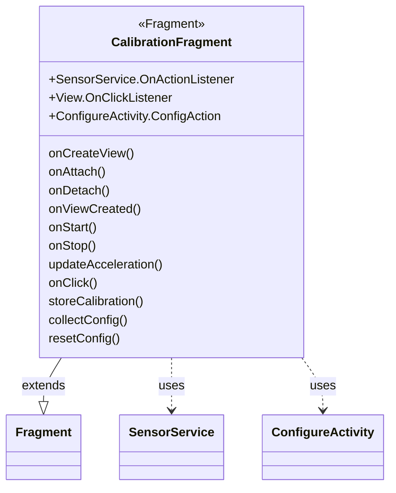

```mermaid
classDiagram
    class CalibrationFragment {
      <<Fragment>>
      +SensorService.OnActionListener
      +View.OnClickListener
      +ConfigureActivity.ConfigAction
      onCreateView()
      onAttach()
      onDetach()
      onViewCreated()
      onStart()
      onStop()
      updateAcceleration()
      onClick()
      storeCalibration()
      collectConfig()
      resetConfig()
    }

    CalibrationFragment --|> Fragment : extends
    CalibrationFragment ..> SensorService : uses
    CalibrationFragment ..> ConfigureActivity : uses
```

[file][\\wsl.localhost\Ubuntu\home\adamsl\linuxBash\note_taker\communication_tests.py]
\\wsl.localhost\Ubuntu\home\adamsl\linuxBash\project-management\plan.md