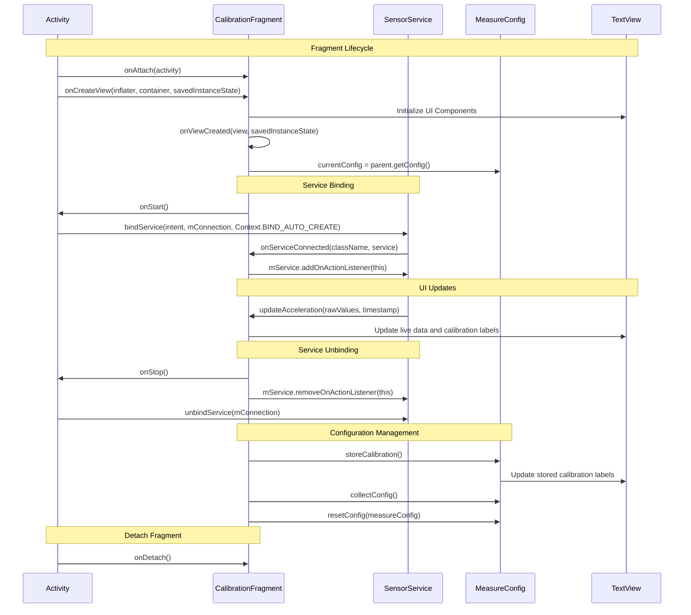

```mermaid
sequenceDiagram
    participant Activity
    participant CalibrationFragment
    participant SensorService
    participant MeasureConfig
    participant TextView

    Note over Activity, TextView: Fragment Lifecycle
    Activity->>CalibrationFragment: onAttach(activity)
    Activity->>CalibrationFragment: onCreateView(inflater, container, savedInstanceState)
    CalibrationFragment->>TextView: Initialize UI Components
    CalibrationFragment->>CalibrationFragment: onViewCreated(view, savedInstanceState)
    CalibrationFragment->>MeasureConfig: currentConfig = parent.getConfig()
    
    Note over CalibrationFragment, SensorService: Service Binding
    CalibrationFragment->>Activity: onStart()
    Activity->>SensorService: bindService(intent, mConnection, Context.BIND_AUTO_CREATE)
    SensorService->>CalibrationFragment: onServiceConnected(className, service)
    CalibrationFragment->>SensorService: mService.addOnActionListener(this)

    Note over CalibrationFragment, TextView: UI Updates
    SensorService->>CalibrationFragment: updateAcceleration(rawValues, timestamp)
    CalibrationFragment->>TextView: Update live data and calibration labels

    Note over CalibrationFragment, SensorService: Service Unbinding
    CalibrationFragment->>Activity: onStop()
    CalibrationFragment->>SensorService: mService.removeOnActionListener(this)
    Activity->>SensorService: unbindService(mConnection)

    Note over CalibrationFragment, MeasureConfig: Configuration Management
    CalibrationFragment->>MeasureConfig: storeCalibration()
    MeasureConfig->>TextView: Update stored calibration labels
    CalibrationFragment->>MeasureConfig: collectConfig()
    CalibrationFragment->>MeasureConfig: resetConfig(measureConfig)

    Note over Activity, CalibrationFragment: Detach Fragment
    Activity->>CalibrationFragment: onDetach()
```
