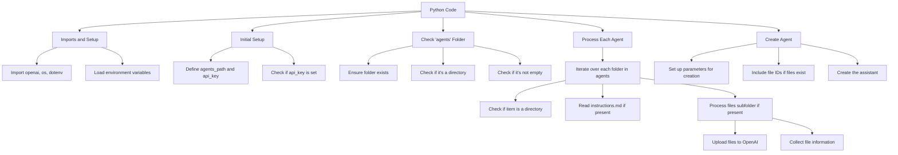

```mermaid
graph TD
    A[Python Code] --> B[Imports and Setup]
    A --> C[Initial Setup]
    A --> D[Check 'agents' Folder]
    A --> E[Process Each Agent]
    A --> F[Create Agent]

    B --> B1[Import openai, os, dotenv]
    B --> B2[Load environment variables]

    C --> C1[Define agents_path and api_key]
    C --> C2[Check if api_key is set]

    D --> D1[Ensure folder exists]
    D --> D2[Check if it's a directory]
    D --> D3[Check if it's not empty]

    E --> E1[Iterate over each folder in agents]
    E1 --> E1A[Check if item is a directory]
    E1 --> E1B[Read instructions.md if present]
    E1 --> E1C[Process files subfolder if present]
    E1C --> E1C1[Upload files to OpenAI]
    E1C --> E1C2[Collect file information]

    F --> F1[Set up parameters for creation]
    F --> F2[Include file IDs if files exist]
    F --> F3[Create the assistant]

```