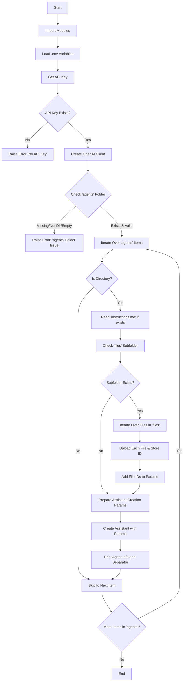

```mermaid
graph TD
    A[Start] --> B[Import Modules]
    B --> C[Load .env Variables]
    C --> D[Get API Key]
    D --> E{API Key Exists?}
    E -->|No| F[Raise Error: No API Key]
    E -->|Yes| G[Create OpenAI Client]
    G --> H{Check 'agents' Folder}
    H -->|Missing/Not Dir/Empty| I[Raise Error: 'agents' Folder Issue]
    H -->|Exists & Valid| J[Iterate Over 'agents' Items]
    J --> K{Is Directory?}
    K -->|No| L[Skip to Next Item]
    K -->|Yes| M[Read 'instructions.md' if exists]
    M --> N[Check 'files' Subfolder]
    N --> O{Subfolder Exists?}
    O -->|No| P[Prepare Assistant Creation Params]
    O -->|Yes| Q[Iterate Over Files in 'files']
    Q --> R[Upload Each File & Store ID]
    R --> S[Add File IDs to Params]
    S --> P
    P --> T[Create Assistant with Params]
    T --> U[Print Agent Info and Separator]
    U --> L
    L --> V{More Items in 'agents'?}
    V -->|Yes| J
    V -->|No| W[End]
```