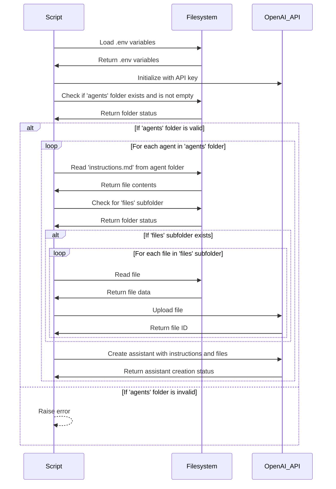

```mermaid
sequenceDiagram
    participant Script
    participant Filesystem
    participant OpenAI_API

    Script->>Filesystem: Load .env variables
    Filesystem->>Script: Return .env variables
    Script->>OpenAI_API: Initialize with API key
    Script->>Filesystem: Check if 'agents' folder exists and is not empty
    Filesystem->>Script: Return folder status

    alt If 'agents' folder is valid
        loop For each agent in 'agents' folder
            Script->>Filesystem: Read 'instructions.md' from agent folder
            Filesystem->>Script: Return file contents
            Script->>Filesystem: Check for 'files' subfolder
            Filesystem->>Script: Return folder status
            alt If 'files' subfolder exists
                loop For each file in 'files' subfolder
                    Script->>Filesystem: Read file
                    Filesystem->>Script: Return file data
                    Script->>OpenAI_API: Upload file
                    OpenAI_API->>Script: Return file ID
                end
            end
            Script->>OpenAI_API: Create assistant with instructions and files
            OpenAI_API->>Script: Return assistant creation status
        end
    else If 'agents' folder is invalid
        Script-->>Script: Raise error
    end
```