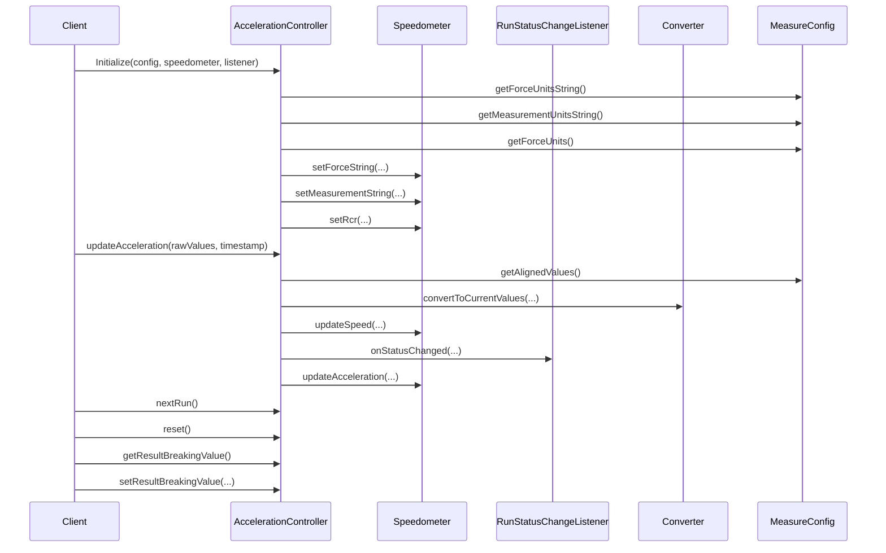
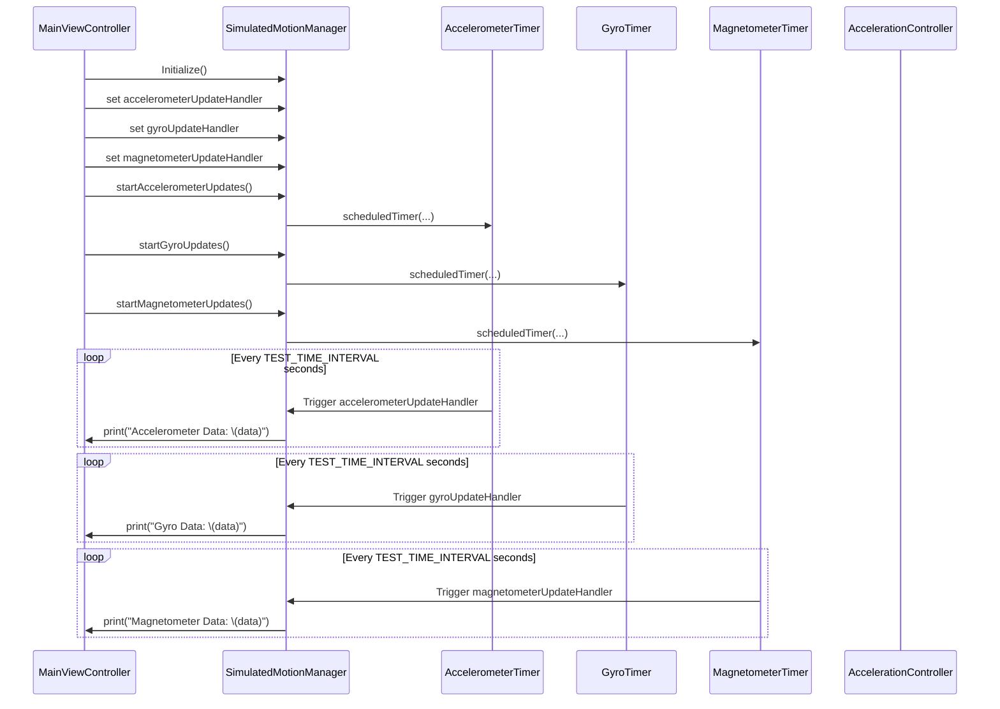
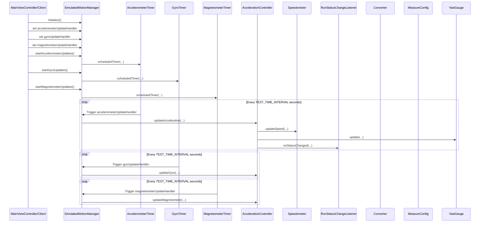
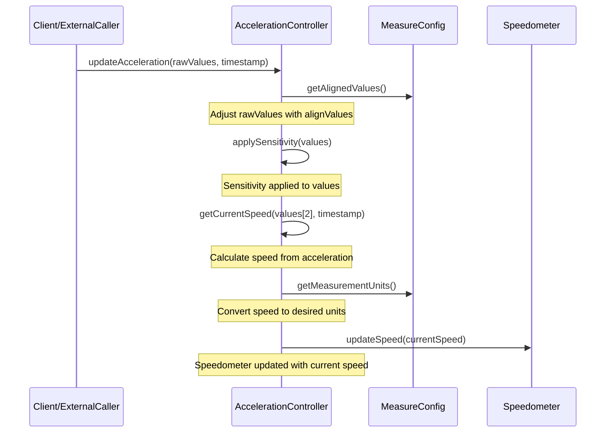

## Without Simulation Code


## With Simulation Code


## Corrected with simulation code


## Please show me the parts of the following code that are calculating speed as you have described:
```java
public class AccelerationController implements SensorService.OnActionListener {
    private static final float NS2S = 1.0f / 1000000000.0f;
    private static final float START_THRESHOLD = 0.5F;
    private static final float SENSETIVITY_THRESHOLD = 0.2F;
    private MeasureConfig config;
    private Speedometer speedometer;
    private RunStatus runStatus;
    private float currentSpeed = 0.0f;
    private float timestamp;
    private float minBreakingValue;
    private float resultBreakingValue;
    private RunStatusChangeListener runStatusChangeListener;

    public AccelerationController(MeasureConfig config, Speedometer speedometer, RunStatusChangeListener runStatusChangeListener) {
        this.config = config;
        this.speedometer = speedometer;
        this.runStatusChangeListener = runStatusChangeListener;
        runStatus = RunStatus.READY_TO_START;
        this.speedometer.setForceString(config.getForceUnitsString());
        this.speedometer.setMeasurementString(config.getMeasurementUnitsString());
        this.speedometer.setRcr(config.getForceUnits() == MeasureConfig.ForceUnits.RCR);
    }

    @Override
    public void updateAcceleration(float[] rawValues, long timestamp) {
        float[] values = new float[3];
        float[] alignValues = config.getAlignedValues();
        if (alignValues != null) {
            for (int i = 0; i < values.length; i++) {
                values[i] = -(rawValues[i] - alignValues[i]);
            }
        } else {
            for (int i = 0; i < values.length; i++) {
                values[i] = -(rawValues[i]);
            }
        }
        values = applySensitivity(values);
        float[] currentValues = convertToCurrentValues(values);
        switch (runStatus) {
            case READY_TO_START:
                if (Math.abs(values[2]) < START_THRESHOLD) {
                    runStatusChangeListener.onStatusChanged(RunStatus.READY_TO_START);
                } else {
                    runStatusChangeListener.onStatusChanged(RunStatus.INVALID);
                }
                break;
            case ACCELERATING:
                float speed = getCurrentSpeed(values[2], timestamp);
                currentSpeed += speed;
                speedometer.updateSpeed(currentSpeed);
                if (currentSpeed >= config.getTargetStoppingSpeed() - config.getTolerance() && currentSpeed <= config.getTargetStoppingSpeed() + config.getTolerance()) {
                    runStatusChangeListener.onStatusChanged(RunStatus.START_BRAKING);
                    this.runStatus = RunStatus.START_BRAKING;
                    minBreakingValue = Float.MAX_VALUE;
                } else if (currentSpeed > config.getTargetStoppingSpeed() + config.getTolerance()) {
                    runStatusChangeListener.onStatusChanged(RunStatus.TOO_FAST);
                    minBreakingValue = Float.MAX_VALUE;
                }
                break;
            case START_BRAKING:
                speed = getCurrentSpeed(values[2], timestamp);
                currentSpeed += speed;
                if (currentValues[2] < minBreakingValue) {
                    minBreakingValue = currentValues[2];
                }
                if (currentSpeed > config.getTargetStoppingSpeed() + config.getTolerance()) {
                    runStatusChangeListener.onStatusChanged(RunStatus.TOO_FAST);
                    minBreakingValue = Float.MAX_VALUE;
                } else {
                    runStatusChangeListener.onStatusChanged(RunStatus.START_BRAKING);
                }
                speedometer.updateSpeed(currentSpeed);
                if (currentSpeed <= config.getMinRecordingSpeed()) {
                    resultBreakingValue = minBreakingValue;
                    runStatusChangeListener.onStatusChanged(RunStatus.BRAKING);
                    this.runStatus = RunStatus.BRAKING;
                    this.speedometer.updateSpeed(-111f);
                }
                break;
        }
        this.timestamp = timestamp;
        speedometer.updateAcceleration(currentValues[2], currentValues[1]);
    }

    private float[] applySensitivity(float[] values) {
        for (int i = 0; i < values.length; i++) {
            if (Math.abs(values[i]) < SENSETIVITY_THRESHOLD) {
                values[i] = 0.0f;
            }
        }
        return values;
    }

    private float getCurrentSpeed(float value, long newTimestamp) {
        float dT = (newTimestamp - this.timestamp) * NS2S;
        float result = value * dT;
        if (config.getMeasurementUnits() == MeasureConfig.MeasurementUnits.METRICS) {
            // Convert to kph
            return result * 3.6f;
        } else {
            // Convert to mph
            return result * 2.2369f;
        }
    }

    private float[] convertToCurrentValues(float[] rawValues) {
        float[] result = null;
        if (config.getForceUnits() == MeasureConfig.ForceUnits.PERCENT_G) {
            result = Converter.rawToGravityPercent(rawValues);
        } else {
            result = Converter.rawToRcr(rawValues);
        }
        return result;
    }

    public void nextRun() {
        switch (runStatus) {
            case READY_TO_START: {
                runStatus = RunStatus.ACCELERATING;
                runStatusChangeListener.onStatusChanged(RunStatus.ACCELERATING);
                currentSpeed = 0.0f;
            }
            break;
            case BRAKING:
                runStatus = RunStatus.ACCELERATING;
                runStatusChangeListener.onStatusChanged(RunStatus.ACCELERATING);
                currentSpeed = 0.0f;
                break;
        }
    }

    public void reset() {
        runStatus = RunStatus.READY_TO_START;
        currentSpeed = 0.0f;
    }

    public float getResultBreakingValue() {
        return Math.abs(resultBreakingValue);
    }

    public void setResultBreakingValue(float resultBreakingValue) {
        this.resultBreakingValue = resultBreakingValue;
    }
}
```

## The acceleration computation process


## Link to conversation about acceleration computation
https://chat.openai.com/share/02992ffc-a63a-4fd9-b257-79ccca1be920
