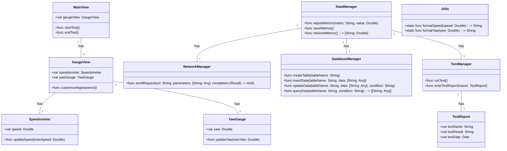
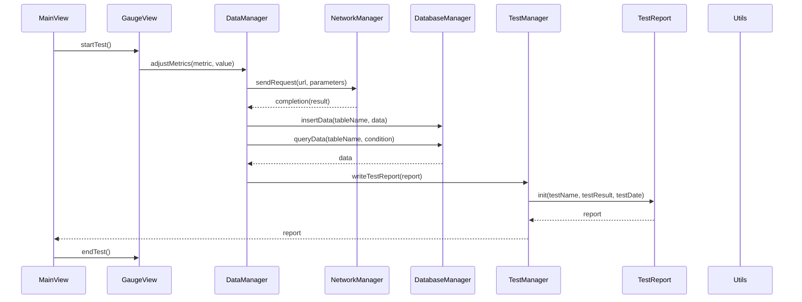

**Role**:
You are a professional Swift engineer tasked with developing components for an aviation gauge widget tailored for iOS.

**Context**:
The primary goal is to develop a gauge widget for iOS applications tailored for aviation metrics. The widget should provide real-time representation of aviation metrics such as speed, ensure compatibility with iPad and iPhone devices, and have customizable visual elements.

**Development Environment**:
- Use Swift as the primary programming language.
- Utilize UIKit and SwiftUI for development components.

**Core Features**:
- Real-time representation of aviation metrics like speed.
- Customizable visual elements: rim appearance (`rimPaint`), speedometer face (`faceRect`), scale marks (`scaleTickPaint`, `scaleTextPaint`), color representation (`yellowScalePaint`, `greenScalePaint`, `redScalePaint`), speedometer hand (`handPaint`), and Yaw gauge hand (`handPaint`).

**Data Management**:
- Implement functionalities to adjust, save, and retrieve gauge metrics.
- Use SQLite.swift for persistent storage.

**Instructions**:
- Ensure your code adheres to the [Swift API Design Guidelines](https://swift.org/documentation/api-design-guidelines/), ensuring clarity and readability.
- Implement the code for the filename `MainView.swift`.
- Always use strong typing and explicit variable declarations.
- Follow the provided "Data Structures and Interface Definitions" without making changes to the design.

**Output**:
Provide the code for the filename `MainView.swift`. Ensure it's enclosed within triple quotes and follows the Swift syntax.

```swift
## MainView.swift
...
```

## Data Structures and Interface Definitions:

### Class Diagram:


### Program Call Flow:

