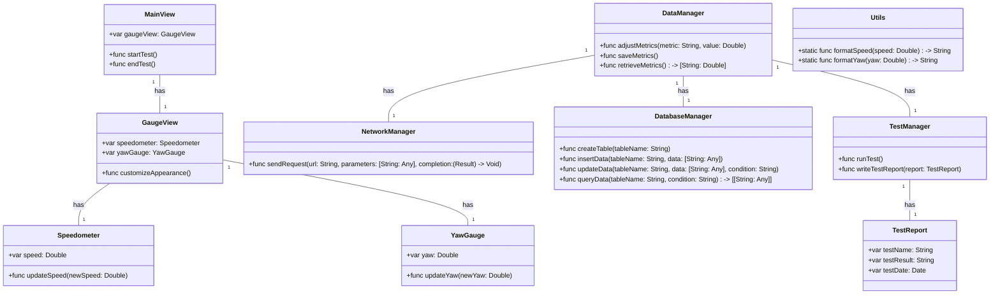
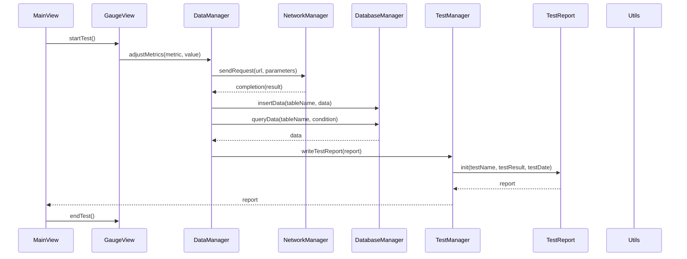

# Context
[Architect: ## Implementation approach
To design a concise, usable, and complete iOS system for the gauge widget, we will follow the following approach:

1. **Data Management**: We will use Core Data as the primary data management framework for the gauge widget. Core Data provides a high-level interface for managing the model layer objects in the application. It offers features like data persistence, data validation, and undo/redo support. Core Data is a powerful and widely used framework in iOS development.

2. **User Interface**: For the user interface, we will use SwiftUI. SwiftUI is a modern UI framework introduced by Apple in iOS 13. It provides a declarative syntax for building user interfaces, making it easier to create complex layouts and animations. SwiftUI also offers built-in support for dynamic type, dark mode, and accessibility features.

3. **Networking**: To handle network requests, we will use Alamofire. Alamofire is a widely used networking library in the iOS community. It provides a simple and elegant API for making HTTP requests, handling responses, and managing network tasks. Alamofire also supports features like authentication, background requests, and request chaining.

4. **Database**: For persistent storage of gauge metrics, we will use SQLite.swift. SQLite.swift is a type-safe, Swift-friendly wrapper around SQLite. It provides a convenient API for working with SQLite databases, including creating tables, inserting, updating, and querying data. SQLite.swift is lightweight, easy to use, and well-documented.

5. **Testing**: For unit testing, we will use XCTest, the built-in testing framework provided by Apple. XCTest offers a comprehensive set of tools and APIs for writing and running tests. It supports features like test assertions, test expectations, and test coverage analysis. XCTest is widely used in the iOS development community and integrates well with Xcode.

## Swift Package Name
```swift
"AviationGaugeWidget"
```

## File List
```swift
[
    "MainView.swift",
    "GaugeView.swift",
    "Speedometer.swift",
    "YawGauge.swift",
    "DataManager.swift",
    "NetworkManager.swift",
    "DatabaseManager.swift",
    "TestManager.swift",
    "TestReport.swift",
    "Utils.swift"
]
```

## Data Structures and Interface Definitions


## Program Call Flow


## Anything Unclear
There are no unclear points.]

## Format example

---
## Required Swift third-party packages
```swift
"""
flask==1.1.2
bcrypt==3.2.0
"""
```

## Required Other language third-party packages
```swift
"""
No third-party ...
"""
```

## Full API spec
```swift
"""
openapi: 3.0.0
...
description: A JSON object ...
"""
```

## Logic Analysis
```swift
[
    ("game.swift", "Contains ..."),
]
```

## Task list
```swift
[
    "game.swift",
]
```

## Shared Knowledge
```swift
"""
'game.swift' contains ...
"""
```

## Anything Unclear
We need ... how to start.
---

-----
Role: You are a project manager; the goal is to break down tasks according to PRD/technical design, give a task list, and analyze task dependencies to start with the prerequisite modules
Requirements: Based on the context, fill in the following missing information, note that all sections are returned in Swift code triple quote form seperatedly. Here the granularity of the task is a file, if there are any missing files, you can supplement them
Attention: Use '##' to split sections, not '#', and '## <SECTION_NAME>' SHOULD WRITE BEFORE the code and triple quote.

## Required Swift third-party packages: Provided in requirements.txt format

## Required Other language third-party packages: Provided in requirements.txt format

## Full API spec: Use OpenAPI 3.0. Describe all APIs that may be used by both frontend and backend.

## Logic Analysis: Provided as a Python list[str, str]. the first is filename, the second is class/method/function should be implemented in this file. Analyze the dependencies between the files, which work should be done first

## Task list: Provided as Python list[str]. Each str is a filename, the more at the beginning, the more it is a prerequisite dependency, should be done first

## Shared Knowledge: Anything that should be public like utils' functions, config's variables details that should make clear first. 

## Anything Unclear Provide as Plain text. Make clear here. For example, don't forget a main entry. don't forget to init 3rd party libs.

