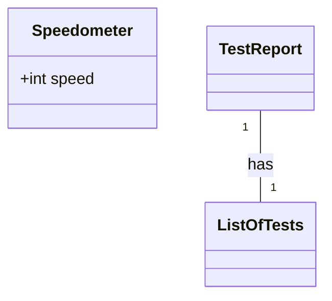
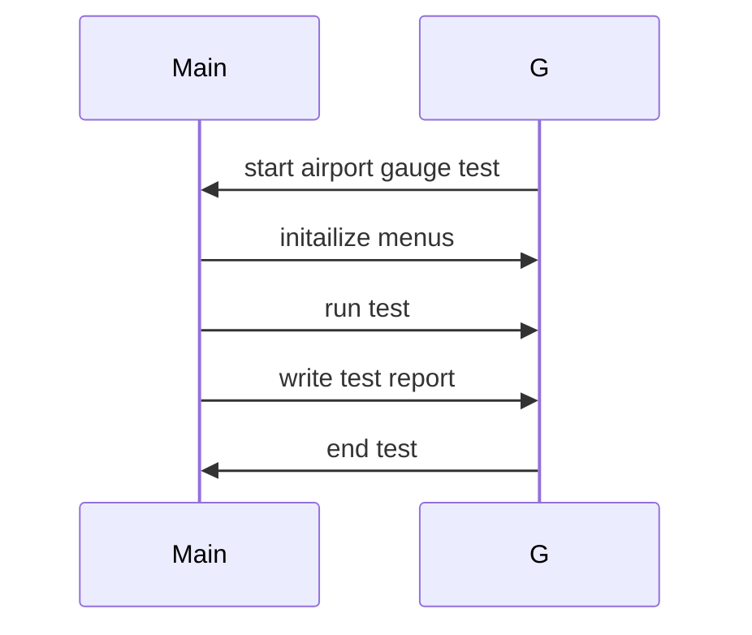

# Context
Provide the necessary context here to guide the respondent:
[Product Manager: ## Original Requirements:

The primary goal is to develop a gauge widget for iOS applications, specifically tailored for aviation metrics. This widget should be compatible with both iPad and iPhone devices and be designed to fit within a larger application.

### Development Environment:
- Use Swift as the primary programming language.
- Utilize UIKit for the main development components.

### Core Features:
- Ensure real-time representation of aviation metrics such as speed.
- Implement smooth visual transitions, possibly using Core Animation for smoother hand movement.
- Allow customizable visual elements for the gauge, including:
  - Rim appearance (`rimPaint`)
  - Face of the speedometer (`faceRect`)
  - Scale marks (`scaleTickPaint`, `scaleTextPaint`)
  - Different scales' color representation (`yellowScalePaint`, `greenScalePaint`, `redScalePaint`)
  - Hand of the speedometer (`handPaint`)
  - Hand of the Yaw gauge in the inner circle of the gauge (`handPaint`)

### Data Management:
- Implement functionalities to adjust, save, and retrieve gauge metrics.
- Use MySQL for persistent storage of these metrics, recording the widget's values as needed.

### Compatibility & User Experience:
- Ensure compatibility across various iOS devices.
- Design an intuitive user interface, with clear visuals making it easy for users to understand speed measurements at a glance.
- Allow customization of the gauge's appearance based on user preferences or application themes.

### Integration:
- The widget should be designed modularly, allowing easy integration into larger applications and accommodating additional metrics, as seen in the initial PRD.

## Product Goals:
- Develop a gauge widget for iOS applications tailored for aviation metrics.
- Ensure real-time representation of aviation metrics such as speed.
- Provide a customizable and intuitive user interface for easy understanding of speed measurements.

## User Stories:
- As a pilot, I want to easily monitor my speed in real-time while flying.
- As an aviation enthusiast, I want to be able to customize the appearance of the gauge widget to match my preferences.
- As a developer, I want to easily integrate the gauge widget into my aviation-related application.
- As a user, I want the gauge widget to be compatible with both iPad and iPhone devices.
- As a user, I want the gauge widget to have smooth visual transitions for a better user experience.

## Competitive Analysis:
- Python Snake Game: A popular game that allows users to control a snake and collect food while avoiding obstacles.
- Speedometer Pro: An iOS app that provides a digital speedometer for users to monitor their speed while driving.
- Aviation Cockpit Instruments: An iOS app that simulates aviation cockpit instruments for training purposes.
- Flight Tracker: An iOS app that allows users to track flights in real-time and provides information such as speed, altitude, and location.
- Aviation Weather: An iOS app that provides weather information specifically for aviation purposes.
- Aviation Calculator: An iOS app that includes various calculators for aviation-related calculations.
- Flight Simulator: An iOS app that simulates flying an aircraft with realistic controls and visuals.

## Competitive Quadrant Chart:
```mermaid
quadrantChart
    title Reach and engagement of aviation gauge widgets
    x-axis Low Reach --> High Reach
    y-axis Low Engagement --> High Engagement
    quadrant-1 Python Snake Game: [0.2, 0.8]
    quadrant-2 Speedometer Pro: [0.6, 0.6]
    quadrant-3 Aviation Cockpit Instruments: [0.4, 0.4]
    quadrant-4 Flight Tracker: [0.7, 0.3]
    quadrant-1 Aviation Weather: [0.3, 0.7]
    quadrant-2 Aviation Calculator: [0.5, 0.5]
    quadrant-3 Flight Simulator: [0.8, 0.2]
    "Our Gauge Widget": [0.6, 0.8]
```

## Requirement Analysis:
The product should be a gauge widget for iOS applications that provides real-time representation of aviation metrics, with a customizable and intuitive user interface. It should be compatible with both iPad and iPhone devices and designed to fit within larger applications. The widget should also have smooth visual transitions and allow for easy integration and customization.

## Requirement Pool:
- Implement a smooth hand movement using Core Animation for the gauge widget. (P0)
- Allow users to adjust, save, and retrieve gauge metrics using MySQL for persistent storage. (P1)
- Ensure compatibility across various iOS devices. (P1)
- Design clear visuals for easy understanding of speed measurements. (P2)
- Provide customizable visual elements for the gauge widget. (P2)

## UI Design draft:
The gauge widget will have a circular shape with a rim appearance, a face for the speedometer, and scale marks for measurement. The gauge will have different color representations for different scales, such as yellow, green, and red. The hand of the speedometer will indicate the current speed, and there will be an additional hand for the Yaw gauge in the inner circle of the gauge. The user will be able to customize the appearance of the gauge, including the rim, face, scale marks, and hand. The gauge widget will be designed to fit within larger applications and will have smooth visual transitions for a better user experience.

## Anything Unclear:
There are no unclear points.]

## Example Format
Here's an example format to follow:

## Implementation approach
- We are going to use the following sutable open source tools ...
- The challenges posed by the requirements are ...

## Swift Package Name
```swift
"airport_gauge_test"
```

## File List
```swift
[
    "main.swift",
]
```

## Data Structures and Interface Definitions


## Program Call Flow

-----
## Instructions:

### Role:
- Assume the role of an expert iOS software architect.
- Design a state-of-the-art, Swift Programming Guidline compliant iOS system.
- Prioritize the use of high-quality open-source tools.

### Requirements:
- Complete each section based on the provided context.
- Address each section individually and in code format.

### Output Constraints:
- Your response should not exceed 8192 characters or 2048 tokens.
- Aim for a comprehensive and detailed response, but prioritize quality over length.

### Formatting:
- Use '##' for section headers. 
- Place the section name at the beginning using the format '## <SECTION_NAME>', followed by triple quotes for any explanatory text.

## Sections to Complete:

## Implementation approach
- Provide in plain text.
- Analyze the challenges posed by the requirements.
- Choose the most suitable open-source framework for the task. 

## Swift Package Name
- Provide as a Python string using triple quotes.
- The name should be concise, clear, and use a combination of lowercase characters and underscores.

## File List
- Provide as a Python list of strings.
- List only the essential files needed for the program ( LESS IS BETTER! ). 
- Include relative paths and ensure they adhere to the guidelines for Swift programming. 
- Always include either 'main.swift' or 'app.swift'.

## Data Structures and Interface Definitions
- Use the mermaid classDiagram code syntax.
- Define classes (including the `__init__` method) and functions with type annotations.
- Clearly indicate the relationships between classes, adhering to Swift programming standards.
- Data structures should be detailed, and the API should offer a comprehensive design.

## Program Call Flow
- Use the sequenceDiagram code syntax.
- Ensure the flow is complete and detailed.
- Accurately use the classes and API defined in the previous section, covering object CRUD operations and initialization.
- The syntax must be correct.

## Anything Unclear 
- Provide in plain text.
- Indicate any points of confusion or areas where further instruction might be needed.
