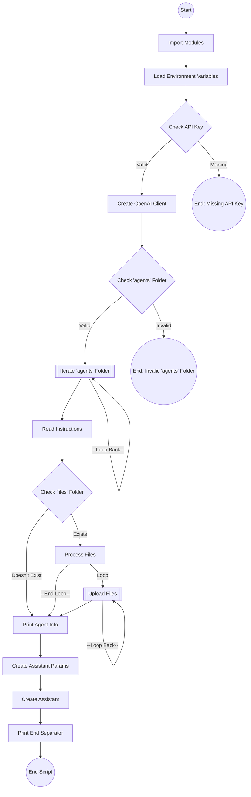

```mermaid
flowchart TB
    start(("Start")) --> import_modules["Import Modules"]
    import_modules --> load_env_variables["Load Environment Variables"]
    load_env_variables --> check_api_key{Check API Key}
    check_api_key -->|Valid|create_openai_client["Create OpenAI Client"]
    check_api_key -->|Missing|end1(("End: Missing API Key"))
    create_openai_client --> check_agents_folder{Check 'agents' Folder}
    check_agents_folder -->|Valid|iterate_agents_folders[[Iterate 'agents' Folder]]
    check_agents_folder -->|Invalid|end2(("End: Invalid 'agents' Folder"))
    iterate_agents_folders --> read_instructions["Read Instructions"]
    iterate_agents_folders -->|--Loop Back--| iterate_agents_folders
    read_instructions --> check_files_folder{Check 'files' Folder}
    check_files_folder -->|Exists|process_files["Process Files"]
    check_files_folder -->|Doesn't Exist|print_agent_info
    process_files -->|Loop|upload_files[[Upload Files]]
    process_files -->|--End Loop--|print_agent_info
    upload_files -->|--Loop Back--|upload_files
    upload_files --> print_agent_info["Print Agent Info"]
    print_agent_info --> create_assistant_params["Create Assistant Params"]
    create_assistant_params --> create_assistant["Create Assistant"]
    create_assistant --> print_end_separator["Print End Separator"]
    print_end_separator --> end3(("End Script"))
```