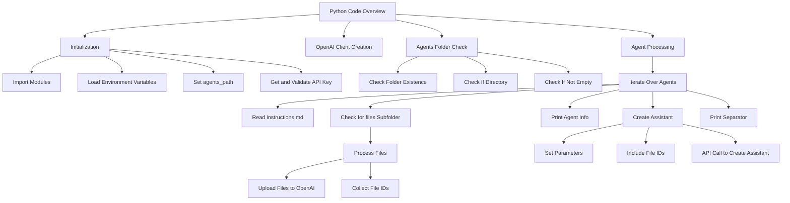

```mermaid
graph TD
    A[Python Code Overview] --> B[Initialization]
    A --> C[OpenAI Client Creation]
    A --> D[Agents Folder Check]
    A --> E[Agent Processing]

    B --> B1[Import Modules]
    B --> B2[Load Environment Variables]
    B --> B3[Set agents_path]
    B --> B4[Get and Validate API Key]

    D --> D1[Check Folder Existence]
    D --> D2[Check If Directory]
    D --> D3[Check If Not Empty]

    E --> E1[Iterate Over Agents]
    E1 --> E2[Read instructions.md]
    E1 --> E3[Check for files Subfolder]
    E3 --> E4[Process Files]
    E4 --> E4a[Upload Files to OpenAI]
    E4 --> E4b[Collect File IDs]
    E1 --> E5[Print Agent Info]
    E1 --> E6[Create Assistant]
    E6 --> E6a[Set Parameters]
    E6 --> E6b[Include File IDs]
    E6 --> E6c[API Call to Create Assistant]
    E1 --> E7[Print Separator]

```