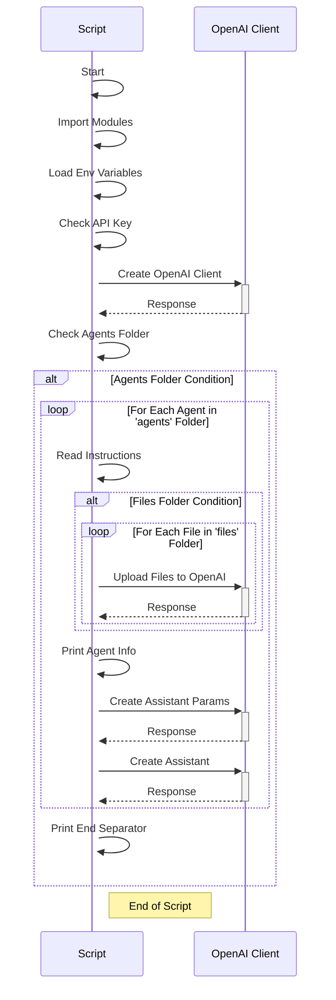

```mermaid
sequenceDiagram
    participant S as Script
    participant O as OpenAI Client
    S->>+S: Start
    S->>S: Import Modules
    S->>S: Load Env Variables
    S->>+S: Check API Key
    S->>+O: Create OpenAI Client
    O-->>-S: Response
    S->>S: Check Agents Folder
    alt Agents Folder Condition
    loop For Each Agent in 'agents' Folder
        S->>S: Read Instructions
        alt Files Folder Condition
            loop For Each File in 'files' Folder
                S->>+O: Upload Files to OpenAI
                O-->>-S: Response
            end
        end
        S->>S: Print Agent Info
        S->>+O: Create Assistant Params
        O-->>-S: Response
        S->>+O: Create Assistant
        O-->>-S: Response
    end
    S->>S: Print End Separator
    end
    Note right of S: End of Script
```