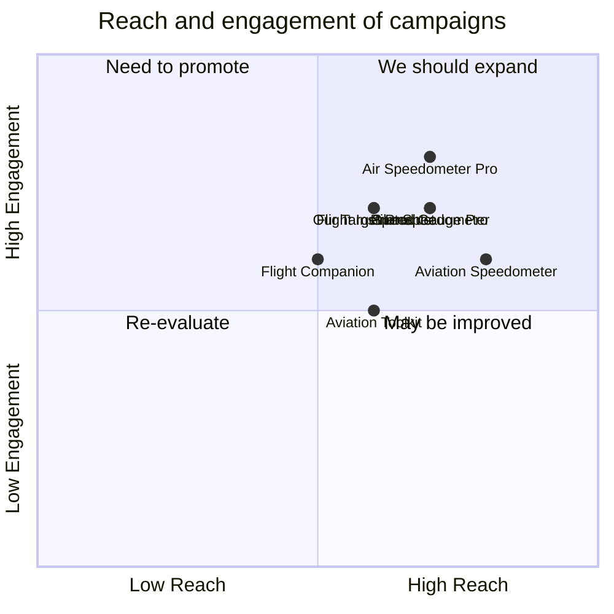

## Original Requirements:
[BOSS: Develop an iOS application for iPad and iPhone that functions as an airplane speedometer gauge. Use Swift and UIKit for the main development. Ensure real-time representation of speed, yaw, and other metrics. Incorporate customizable visual elements (rim, face, ticks) and leverage Core Animation for smooth visual transitions. Implement functionalities to adjust, save, and retrieve gauge metrics using Core Data. Prioritize compatibility across iOS devices and ensure an intuitive user experience. Provide synchronization capabilities with other aviation-related iOS applications.]

## Product Goals:
```python
[
    "Create a high-quality airplane speedometer gauge application for iOS devices",
    "Ensure real-time representation of speed, yaw, and other metrics",
    "Provide customization options for visual elements and smooth visual transitions"
]
```

## User Stories:
```python
[
    "As a pilot, I want to have a reliable speedometer gauge on my iOS device to monitor my airplane's speed and other metrics in real-time.",
    "As a user, I want to be able to customize the visual elements of the speedometer gauge, such as the rim, face, and ticks, to suit my personal preferences.",
    "As a user, I want the speedometer gauge to have smooth visual transitions and animations for a more enjoyable user experience.",
    "As a pilot, I want to be able to adjust, save, and retrieve gauge metrics using Core Data for easy access and management.",
    "As a user, I want the speedometer gauge to be compatible with different iOS devices, including iPad and iPhone, for flexibility in usage."
]
```

## Competitive Analysis:
```python
[
    "Air Speedometer Pro: A popular airplane speedometer gauge application for iOS devices with customizable visual elements and real-time representation of speed and other metrics.",
    "Flight Instruments: An aviation-related iOS application that provides a comprehensive set of flight instruments, including a speedometer gauge, for pilots.",
    "Aviation Speedometer: An iOS application specifically designed for aviation enthusiasts, offering a speedometer gauge with customizable visual elements and synchronization capabilities with other aviation-related apps.",
    "Speed Gauge Pro: A feature-rich speedometer gauge application for iOS devices, offering real-time speed representation, customizable visual elements, and smooth visual transitions.",
    "Flight Companion: An iOS application that provides various aviation-related tools and features, including a speedometer gauge, for pilots.",
    "Aviation Toolkit: A comprehensive toolkit for aviation enthusiasts, including a speedometer gauge with real-time speed representation and customizable visual elements.",
    "Pilot Speedometer: An iOS application designed for pilots, offering a speedometer gauge with real-time speed representation and synchronization capabilities with other aviation-related apps."
]
```

## Competitive Quadrant Chart:


## Requirement Analysis:
The product should be an iOS application for iPad and iPhone that functions as an airplane speedometer gauge. It should provide real-time representation of speed, yaw, and other metrics. The application should incorporate customizable visual elements, such as the rim, face, and ticks, and leverage Core Animation for smooth visual transitions. It should also implement functionalities to adjust, save, and retrieve gauge metrics using Core Data. The application should prioritize compatibility across iOS devices and ensure an intuitive user experience. Additionally, it should provide synchronization capabilities with other aviation-related iOS applications.

## Requirement Pool:
```python
[
    ("Implement a real-time representation of yaw and other metrics", "P0"),
    ("Add customization options for visual elements (rim, face, ticks)", "P1"),
    ("Leverage Core Animation for smooth visual transitions", "P1"),
    ("Implement functionalities to adjust, save, and retrieve gauge metrics using Core Data", "P0"),
    ("Ensure compatibility across iOS devices (iPad and iPhone)", "P0")
]
```

## UI Design draft:
The speedometer gauge application will have a clean and intuitive user interface. It will consist of a circular gauge with a customizable rim, face, and ticks. The gauge will display the current speed and other metrics in real-time. Users will be able to adjust the gauge metrics using intuitive controls. The application will also provide options to save and retrieve gauge metrics using Core Data. Smooth visual transitions and animations will be implemented using Core Animation. The design will prioritize compatibility across iOS devices, ensuring a consistent user experience on both iPad and iPhone.

## Anything Unclear:
There are no unclear points.