## Implementation approach
To implement the airplane speedometer gauge application for iOS devices, we will follow the following approach:

1. **Real-time representation of speed and other metrics**: We will use the Core Location framework to access the device's GPS data and retrieve the speed and other relevant metrics in real-time.

2. **Customization options for visual elements**: We will leverage the power of Core Animation to create customizable visual elements for the speedometer gauge, such as the rim, face, and ticks. We will use open-source libraries like SwiftSVG or SVGKit to import vector graphics for the visual elements.

3. **Smooth visual transitions**: We will utilize Core Animation to create smooth visual transitions and animations for the speedometer gauge. We can use open-source libraries like Lottie or Hero to simplify the animation implementation.

4. **Adjust, save, and retrieve gauge metrics using Core Data**: We will use Core Data to store and manage the gauge metrics. Core Data provides a powerful and efficient way to persist data in iOS applications. We can use open-source libraries like CoreDataKit or MagicalRecord to simplify the Core Data implementation.

5. **Compatibility across iOS devices**: We will ensure compatibility across different iOS devices, including iPad and iPhone, by utilizing the Auto Layout system provided by UIKit. Auto Layout allows us to create adaptive user interfaces that adjust to different screen sizes and orientations.

6. **Intuitive user experience**: We will focus on creating a clean and intuitive user interface that is easy to navigate and understand. We can use open-source libraries like SnapKit or PureLayout to simplify the layout and constraint management.

7. **Synchronization capabilities with other aviation-related iOS applications**: We will implement synchronization capabilities by integrating with aviation-related APIs or by implementing data exchange protocols like JSON or XML. We can use open-source libraries like Alamofire or SwiftyJSON to simplify the networking and data parsing tasks.

## Swift Package Name
```swift
"AirplaneSpeedometerGauge"
```

## File List
```swift
[
    "MainViewController.swift",
    "SpeedometerView.swift",
    "CustomizationViewController.swift",
    "DataStorageManager.swift",
    "NetworkingManager.swift",
    "Models/SpeedometerMetrics.swift",
    "Helpers/AnimationHelper.swift",
    "Helpers/LocationHelper.swift",
    "Helpers/UserDefaultsHelper.swift",
    "Helpers/NetworkHelper.swift",
    "Resources/Assets.xcassets",
    "Resources/CustomizationOptions.json",
    "Resources/NetworkingConfig.plist"
]
```

## Data Structures and Interface Definitions

```mermaid
classDiagram
    class MainViewController{
        -SpeedometerView speedometerView
        -CustomizationViewController customizationViewController
        -DataStorageManager dataStorageManager
        -NetworkingManager networkingManager
        +void viewDidLoad()
        +void updateSpeedometerMetrics(SpeedometerMetrics metrics)
        +void saveSpeedometerMetrics(SpeedometerMetrics metrics)
        +SpeedometerMetrics retrieveSpeedometerMetrics()
        +void syncWithOtherApps()
    }

    class SpeedometerView{
        -UIImageView rimImageView
        -UIImageView faceImageView
        -UIImageView ticksImageView
        -UILabel speedLabel
        +void setSpeed(int speed)
        +void setRimImage(UIImage image)
        +void setFaceImage(UIImage image)
        +void setTicksImage(UIImage image)
    }

    class CustomizationViewController{
        -UITableView customizationOptionsTableView
        -[CustomizationOption] customizationOptions
        +void viewDidLoad()
        +void saveCustomizationOptions()
    }

    class DataStorageManager{
        +void saveMetrics(SpeedometerMetrics metrics)
        +SpeedometerMetrics retrieveMetrics()
    }

    class NetworkingManager{
        +void syncWithOtherApps()
    }

    class SpeedometerMetrics{
        +int speed
        +int yaw
        +int otherMetrics
    }

    class AnimationHelper{
        +void animateSpeedometerView(SpeedometerView speedometerView, SpeedometerMetrics metrics)
    }

    class LocationHelper{
        +void startUpdatingLocation()
        +void stopUpdatingLocation()
        +CLLocationCoordinate2D getCurrentLocation()
        +double getCurrentSpeed()
    }

    class UserDefaultsHelper{
        +void saveObject(object: Any, forKey: String)
        +Any retrieveObject(forKey: String)
    }

    class NetworkHelper{
        +void sendRequest(url: URL, parameters: [String: Any], completion: (Data?, Error?) -> Void)
        +void parseResponse(data: Data) -> [String: Any]
    }
```


## Program Call Flow
```mermaid
sequenceDiagram
    participant M as MainViewController
    participant S as SpeedometerView
    participant C as CustomizationViewController
    participant D as DataStorageManager
    participant N as NetworkingManager
    participant A as AnimationHelper
    participant L as LocationHelper
    participant U as UserDefaultsHelper
    participant H as NetworkHelper

    M->>+S: viewDidLoad()
    M->>+D: viewDidLoad()
    M->>+N: viewDidLoad()
    M->>+L: viewDidLoad()
    M->>+U: viewDidLoad()

    M->>+L: startUpdatingLocation()
    L->>-M: getCurrentSpeed()
    M->>+S: setSpeed(speed)

    M->>+D: retrieveSpeedometerMetrics()
    D->>-M: SpeedometerMetrics
    M->>+S: setRimImage(image)
    M->>+S: setFaceImage(image)
    M->>+S: setTicksImage(image)

    M->>+C: viewDidLoad()
    C->>-M: customizationOptions
    M->>+S: setRimImage(image)
    M->>+S: setFaceImage(image)
    M->>+S: setTicksImage(image)

    M->>+S: setSpeed(speed)
    M->>+D: saveSpeedometerMetrics(metrics)
    M->>+N: syncWithOtherApps()

    M->>+A: animateSpeedometerView(speedometerView, metrics)
    A->>-M: animatedSpeedometerView

    M->>-S: speedometerView
    S->>-M: updatedSpeedometerView
```

## Anything Unclear
There are no unclear points.