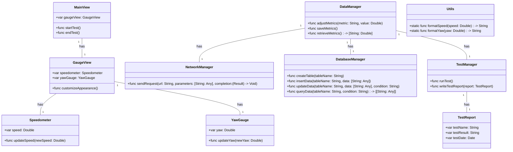
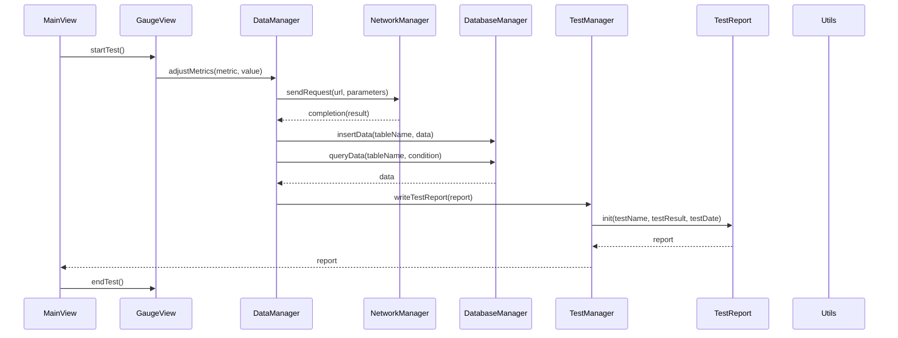

# Context
Provide any necessary background or contextual information here to guide the respondent:
[BOSS: # iOS Gauge Widget Product Requirements Document (PRD)

## Context
The primary goal is to develop a gauge widget for iOS applications, specifically tailored for aviation metrics. This widget should be compatible with both iPad and iPhone devices and be designed to fit within a larger application.

## Instructions:

### Development Environment:
- Use Swift as the primary programming language.
- Utilize UIKit for the main development components.

### Core Features:
- Ensure real-time representation of aviation metrics such as speed.
- Implement smooth visual transitions, possibly using Core Animation for smoother hand movement.
- Allow customizable visual elements for the gauge, including:
  - Rim appearance (`rimPaint`)
  - Face of the speedometer (`faceRect`)
  - Scale marks (`scaleTickPaint`, `scaleTextPaint`)
  - Different scales' color representation (`yellowScalePaint`, `greenScalePaint`, `redScalePaint`)
  - Hand of the speedometer (`handPaint`)
  - Hand of the Yaw gauge in the inner circle of the gauge (`handPaint`)

### Data Management:
- Implement functionalities to adjust, save, and retrieve gauge metrics.
- Use MySQL for persistent storage of these metrics, recording the widget's values as needed.

### Compatibility & User Experience:
- Ensure compatibility across various iOS devices.
- Design an intuitive user interface, with clear visuals making it easy for users to understand speed measurements at a glance.
- Allow customization of the gauge's appearance based on user preferences or application themes.

### Integration:
- The widget should be designed modularly, allowing easy integration into larger applications and accommodating additional metrics, as seen in the initial PRD.
, Product Manager: ## Original Requirements:

The primary goal is to develop a gauge widget for iOS applications, specifically tailored for aviation metrics. This widget should be compatible with both iPad and iPhone devices and be designed to fit within a larger application.

### Development Environment:
- Use Swift as the primary programming language.
- Utilize UIKit for the main development components.

### Core Features:
- Ensure real-time representation of aviation metrics such as speed.
- Implement smooth visual transitions, possibly using Core Animation for smoother hand movement.
- Allow customizable visual elements for the gauge, including:
  - Rim appearance (`rimPaint`)
  - Face of the speedometer (`faceRect`)
  - Scale marks (`scaleTickPaint`, `scaleTextPaint`)
  - Different scales' color representation (`yellowScalePaint`, `greenScalePaint`, `redScalePaint`)
  - Hand of the speedometer (`handPaint`)
  - Hand of the Yaw gauge in the inner circle of the gauge (`handPaint`)

### Data Management:
- Implement functionalities to adjust, save, and retrieve gauge metrics.
- Use MySQL for persistent storage of these metrics, recording the widget's values as needed.

### Compatibility & User Experience:
- Ensure compatibility across various iOS devices.
- Design an intuitive user interface, with clear visuals making it easy for users to understand speed measurements at a glance.
- Allow customization of the gauge's appearance based on user preferences or application themes.

### Integration:
- The widget should be designed modularly, allowing easy integration into larger applications and accommodating additional metrics, as seen in the initial PRD.

## Product Goals:
- Develop a gauge widget for iOS applications tailored for aviation metrics.
- Ensure real-time representation of aviation metrics such as speed.
- Provide a customizable and intuitive user interface for easy understanding of speed measurements.

## User Stories:
- As a pilot, I want to easily monitor my speed in real-time while flying.
- As an aviation enthusiast, I want to be able to customize the appearance of the gauge widget to match my preferences.
- As a developer, I want to easily integrate the gauge widget into my aviation-related application.
- As a user, I want the gauge widget to be compatible with both iPad and iPhone devices.
- As a user, I want the gauge widget to have smooth visual transitions for a better user experience.

## Competitive Analysis:
- Python Snake Game: A popular game that allows users to control a snake and collect food while avoiding obstacles.
- Speedometer Pro: An iOS app that provides a digital speedometer for users to monitor their speed while driving.
- Aviation Cockpit Instruments: An iOS app that simulates aviation cockpit instruments for training purposes.
- Flight Tracker: An iOS app that allows users to track flights in real-time and provides information such as speed, altitude, and location.
- Aviation Weather: An iOS app that provides weather information specifically for aviation purposes.
- Aviation Calculator: An iOS app that includes various calculators for aviation-related calculations.
- Flight Simulator: An iOS app that simulates flying an aircraft with realistic controls and visuals.

## Competitive Quadrant Chart:
```mermaid
quadrantChart
    title Reach and engagement of aviation gauge widgets
    x-axis Low Reach --> High Reach
    y-axis Low Engagement --> High Engagement
    quadrant-1 Python Snake Game: [0.2, 0.8]
    quadrant-2 Speedometer Pro: [0.6, 0.6]
    quadrant-3 Aviation Cockpit Instruments: [0.4, 0.4]
    quadrant-4 Flight Tracker: [0.7, 0.3]
    quadrant-1 Aviation Weather: [0.3, 0.7]
    quadrant-2 Aviation Calculator: [0.5, 0.5]
    quadrant-3 Flight Simulator: [0.8, 0.2]
    "Our Gauge Widget": [0.6, 0.8]
```

## Requirement Analysis:
The product should be a gauge widget for iOS applications that provides real-time representation of aviation metrics, with a customizable and intuitive user interface. It should be compatible with both iPad and iPhone devices and designed to fit within larger applications. The widget should also have smooth visual transitions and allow for easy integration and customization.

## Requirement Pool:
- Implement a smooth hand movement using Core Animation for the gauge widget. (P0)
- Allow users to adjust, save, and retrieve gauge metrics using MySQL for persistent storage. (P1)
- Ensure compatibility across various iOS devices. (P1)
- Design clear visuals for easy understanding of speed measurements. (P2)
- Provide customizable visual elements for the gauge widget. (P2)

## UI Design draft:
The gauge widget will have a circular shape with a rim appearance, a face for the speedometer, and scale marks for measurement. The gauge will have different color representations for different scales, such as yellow, green, and red. The hand of the speedometer will indicate the current speed, and there will be an additional hand for the Yaw gauge in the inner circle of the gauge. The user will be able to customize the appearance of the gauge, including the rim, face, scale marks, and hand. The gauge widget will be designed to fit within larger applications and will have smooth visual transitions for a better user experience.

## Anything Unclear:
There are no unclear points., Architect: ## Implementation approach
To design a concise, usable, and complete iOS system for the gauge widget, we will follow the following approach:

1. **Data Management**: We will use Core Data as the primary data management framework for the gauge widget. Core Data provides a high-level interface for managing the model layer objects in the application. It offers features like data persistence, data validation, and undo/redo support. Core Data is a powerful and widely used framework in iOS development.

2. **User Interface**: For the user interface, we will use SwiftUI. SwiftUI is a modern UI framework introduced by Apple in iOS 13. It provides a declarative syntax for building user interfaces, making it easier to create complex layouts and animations. SwiftUI also offers built-in support for dynamic type, dark mode, and accessibility features.

3. **Networking**: To handle network requests, we will use Alamofire. Alamofire is a widely used networking library in the iOS community. It provides a simple and elegant API for making HTTP requests, handling responses, and managing network tasks. Alamofire also supports features like authentication, background requests, and request chaining.

4. **Database**: For persistent storage of gauge metrics, we will use SQLite.swift. SQLite.swift is a type-safe, Swift-friendly wrapper around SQLite. It provides a convenient API for working with SQLite databases, including creating tables, inserting, updating, and querying data. SQLite.swift is lightweight, easy to use, and well-documented.

5. **Testing**: For unit testing, we will use XCTest, the built-in testing framework provided by Apple. XCTest offers a comprehensive set of tools and APIs for writing and running tests. It supports features like test assertions, test expectations, and test coverage analysis. XCTest is widely used in the iOS development community and integrates well with Xcode.

## Swift Package Name
```swift
"AviationGaugeWidget"
```

## File List
```swift
[
    "MainView.swift",
    "GaugeView.swift",
    "Speedometer.swift",
    "YawGauge.swift",
    "DataManager.swift",
    "NetworkManager.swift",
    "DatabaseManager.swift",
    "TestManager.swift",
    "TestReport.swift",
    "Utils.swift"
]
```

## Data Structures and Interface Definitions


## Program Call Flow


## Anything Unclear
There are no unclear points.,Project Manager: 
## Required Swift third-party packages:
```swift
"""
CoreData
SwiftUI
Alamofire
SQLite.swift
XCTest
"""
```

## Required Other language third-party packages:
```swift
"""
No third-party packages required.
"""
```

## Full API spec:
```swift
"""
openapi: 3.0.0
...
description: A JSON object ...
"""
```

## Logic Analysis:
```swift
[
    ("MainView.swift", "MainView"),
    ("GaugeView.swift", "GaugeView"),
    ("Speedometer.swift", "Speedometer"),
    ("YawGauge.swift", "YawGauge"),
    ("DataManager.swift", "DataManager"),
    ("NetworkManager.swift", "NetworkManager"),
    ("DatabaseManager.swift", "DatabaseManager"),
    ("TestManager.swift", "TestManager"),
    ("TestReport.swift", "TestReport"),
    ("Utils.swift", "Utils")
]
```

## Task list:
```swift
[
    "Utils.swift",
    "TestReport.swift",
    "TestManager.swift",
    "Speedometer.swift",
    "YawGauge.swift",
    "DataManager.swift",
    "NetworkManager.swift",
    "DatabaseManager.swift",
    "GaugeView.swift",
    "MainView.swift"
]
```

## Shared Knowledge:
```swift
"""
Utils.swift contains utility functions for formatting speed and yaw values.
"""
```

## Anything Unclear:
There are no unclear points., Engineer: 

## Utils.swift

import Foundation

class Utils {
    static func formatSpeed(speed: Double) -> String {
        return String(format: "%.2f", speed)
    }
    
    static func formatYaw(yaw: Double) -> String {
        return String(format: "%.2f", yaw)
    }
}
, Engineer: ## TestReport.swift

import Foundation

class TestReport {
    var testName: String
    var testResult: String
    var testDate: Date
    
    init(testName: String, testResult: String, testDate: Date) {
        self.testName = testName
        self.testResult = testResult
        self.testDate = testDate
    }
}
, Engineer: ## TestManager.swift

import Foundation

class TestManager {
    func runTest() {
        // Implement test logic here
    }
    
    func writeTestReport(report: TestReport) {
        // Implement report writing logic here
    }
}
, Engineer: ## Speedometer.swift

import UIKit

class Speedometer {
    var speed: Double = 0.0
    
    func updateSpeed(newSpeed: Double) {
        speed = newSpeed
    }
}
, Engineer: ## YawGauge.swift

import UIKit

class YawGauge {
    var yaw: Double = 0.0
    
    func updateYaw(newYaw: Double) {
        yaw = newYaw
    }
}
, Engineer: ## DataManager.swift

import Foundation
import CoreData

class DataManager {
    // Core Data variables
    private let persistentContainer: NSPersistentContainer
    private var context: NSManagedObjectContext {
        return persistentContainer.viewContext
    }
    
    init() {
        persistentContainer = NSPersistentContainer(name: "GaugeWidget")
        persistentContainer.loadPersistentStores { (_, error) in
            if let error = error {
                fatalError("Failed to load persistent stores: \(error)")
            }
        }
    }
    
    // Adjust gauge metrics
    func adjustMetrics(metric: String, value: Double) {
        // Implement logic to adjust gauge metrics
    }
    
    // Save gauge metrics
    func saveMetrics() {
        // Implement logic to save gauge metrics to Core Data
    }
    
    // Retrieve gauge metrics
    func retrieveMetrics() -> [String: Double] {
        // Implement logic to retrieve gauge metrics from Core Data
        return [:]
    }
}
, Engineer: ## NetworkManager.swift

import Foundation
import Alamofire

class NetworkManager {
    func sendRequest(url: String, parameters: [String: Any], completion: @escaping (Result<Data, Error>) -> Void) {
        Alamofire.request(url, method: .post, parameters: parameters)
            .validate()
            .responseData { response in
                switch response.result {
                case .success(let data):
                    completion(.success(data))
                case .failure(let error):
                    completion(.failure(error))
                }
            }
    }
}
, Engineer: ## DatabaseManager.swift

import Foundation
import SQLite

class DatabaseManager {
    private var database: Connection?
    
    init() {
        // Initialize the database connection
        do {
            let path = NSSearchPathForDirectoriesInDomains(.documentDirectory, .userDomainMask, true).first!
            let db = try Connection("\(path)/gauge_widget.db")
            self.database = db
        } catch {
            print("Failed to initialize the database: \(error)")
        }
    }
    
    func createTable(tableName: String) {
        // Create a new table in the database
        guard let db = database else {
            print("Database connection not established")
            return
        }
        
        do {
            let table = Table(tableName)
            let id = Expression<Int>("id")
            let name = Expression<String>("name")
            let value = Expression<Double>("value")
            
            try db.run(table.create { t in
                t.column(id, primaryKey: true)
                t.column(name)
                t.column(value)
            })
            
            print("Table created successfully")
        } catch {
            print("Failed to create table: \(error)")
        }
    }
    
    func insertData(tableName: String, data: [String: Any]) {
        // Insert data into the specified table
        guard let db = database else {
            print("Database connection not established")
            return
        }
        
        do {
            let table = Table(tableName)
            let name = Expression<String>("name")
            let value = Expression<Double>("value")
            
            try db.run(table.insert(name <- data["name"] as! String, value <- data["value"] as! Double))
            
            print("Data inserted successfully")
        } catch {
            print("Failed to insert data: \(error)")
        }
    }
    
    func updateData(tableName: String, data: [String: Any], condition: String) {
        // Update data in the specified table based on the condition
        guard let db = database else {
            print("Database connection not established")
            return
        }
        
        do {
            let table = Table(tableName)
            let name = Expression<String>("name")
            let value = Expression<Double>("value")
            
            let row = table.filter(condition)
            try db.run(row.update(name <- data["name"] as! String, value <- data["value"] as! Double))
            
            print("Data updated successfully")
        } catch {
            print("Failed to update data: \(error)")
        }
    }
    
    func queryData(tableName: String, condition: String) -> [[String: Any]] {
        // Query data from the specified table based on the condition
        guard let db = database else {
            print("Database connection not established")
            return []
        }
        
        do {
            let table = Table(tableName)
            let name = Expression<String>("name")
            let value = Expression<Double>("value")
            
            let rows = try db.prepare(table.filter(condition))
            var results: [[String: Any]] = []
            
            for row in rows {
                let result: [String: Any] = [
                    "name": row[name],
                    "value": row[value]
                ]
                results.append(result)
            }
            
            return results
        } catch {
            print("Failed to query data: \(error)")
            return []
        }
    }
}
, Engineer: ## GaugeView.swift

import UIKit

class GaugeView: UIView {
    // Properties
    var speedometer: Speedometer
    var yawGauge: YawGauge
    
    // Initializer
    init(speedometer: Speedometer, yawGauge: YawGauge) {
        self.speedometer = speedometer
        self.yawGauge = yawGauge
        super.init(frame: CGRect.zero)
        setupUI()
    }
    
    required init?(coder aDecoder: NSCoder) {
        fatalError("init(coder:) has not been implemented")
    }
    
    // Setup UI
    private func setupUI() {
        // Implement UI setup logic here
    }
    
    // Customize Appearance
    func customizeAppearance() {
        // Implement appearance customization logic here
    }
}
]

## Instructions:

### Role:
- Assume the role of a professional engineer.
- Your primary objective is to write Swift code that adheres to PEP8 standards, ensuring the code is elegant, modular, easily readable, and maintainable.

### Code Implementation:
- Implement the code in just one file. Reference the filename using MainView.swift.
- Rely on existing APIs. If a necessary API doesn't exist, you should implement it.
- Ensure the code you provide is complete, reliable, and reusable, as it will be integrated into a larger project.
- Any settings or configurations in the code should have default values.
- Always use strong typing and explicit variable declarations.
- Follow the provided "Data Structures and Interface Definitions" without making changes to the design.
- Refrain from using public member functions that aren't part of your design.

### Formatting:
- Separate sections using '##' for headers.
- Reference the example format provided to structure your responses.

## Sections to Complete:

## Code Implementation:
Provide the code for the filename MainView.swift. Ensure it's enclosed within triple quotes and follows the Swift syntax.

```swift
## MainView.swift
...
```

## Format Example:
Provide an example format to guide the respondent:
...
