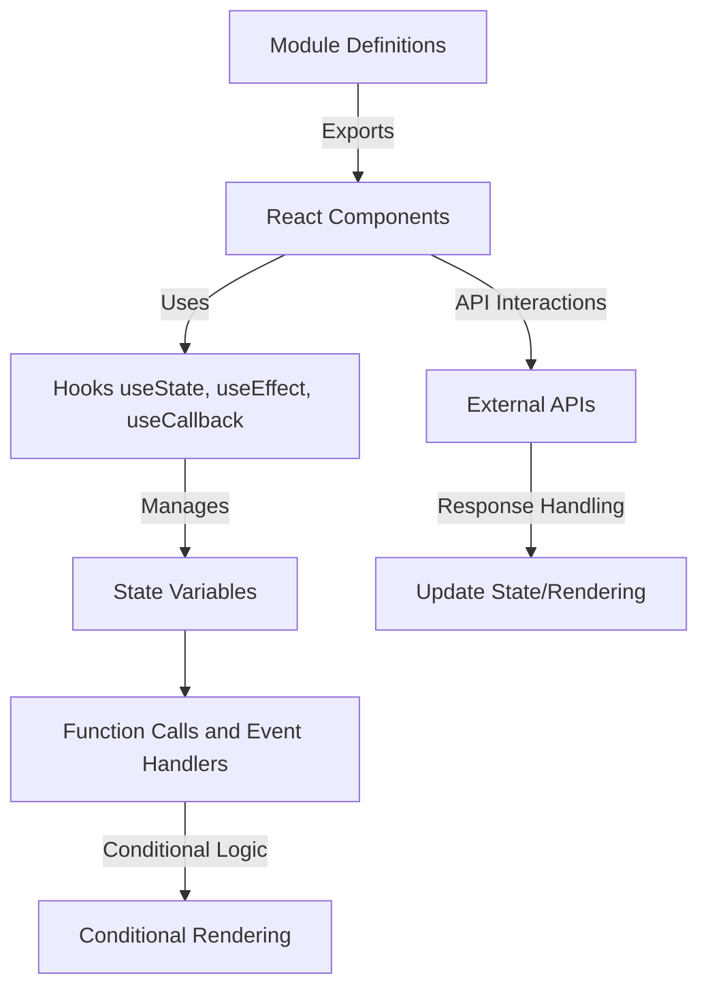

```mermaid
graph TD
    A[Module Definitions] -->|Exports| B[React Components]
    B -->|Uses| C[Hooks useState, useEffect, useCallback]
    C -->|Manages| D[State Variables]
    D --> E[Function Calls and Event Handlers]
    E -->|Conditional Logic| F[Conditional Rendering]
    B -->|API Interactions| G[External APIs]
    G -->|Response Handling| H[Update State/Rendering]
```
